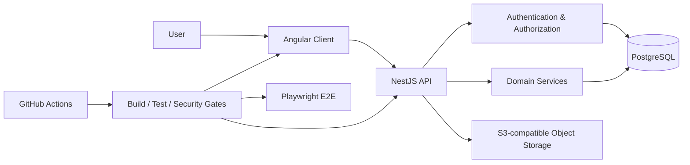

# MicroGreenPilot

**A full-stack production-management platform for microgreen growers.**

**Angular 22 · NestJS 12 · TypeScript 6 · PostgreSQL 16 · Drizzle ORM · Playwright · Docker · GitHub Actions**

MicroGreenPilot is a personal full-stack engineering project I am designing and building to make microgreen production easier to plan, operate, and scale.

The product brings account setup, grow-space configuration, trays, racks, tasks, production state, and future planning/AI-assisted workflows into one system.

> **Portfolio note:** active development happens in a private repository. This public repository is a curated technical view of the product, architecture, engineering decisions, testing strategy, and selected implementation work.

## At a glance

| | |
| --- | --- |
| **Status** | Active development / pre-release |
| **My role** | Product design, frontend, backend, data model, testing, CI/CD, security architecture |
| **Frontend** | Angular 22, TypeScript 6, RxJS, Tailwind CSS 4 |
| **Backend** | NestJS 12, TypeScript 6, Better Auth |
| **Data** | PostgreSQL 16, Drizzle ORM |
| **Testing** | Jest, Supertest, Jasmine/Karma, Playwright |
| **Developer environment** | Docker Compose |
| **CI/CD** | GitHub Actions |
| **Languages** | English and Swedish |

## My role

I work on MicroGreenPilot end to end.

That includes:

- product and workflow design
- Angular application architecture and UI implementation
- NestJS API design and domain logic
- PostgreSQL data modeling and Drizzle migrations
- authentication, authorization, account security, and role boundaries
- unit, integration, database, and Playwright end-to-end testing
- Docker-based local development
- GitHub Actions CI design, parallelization, and cost optimization
- internationalization, accessibility, and responsive behavior

The project is intentionally broad because I use it to practice the same kinds of cross-cutting engineering decisions that appear in production systems.

## The problem

A microgreen operation quickly becomes more than a collection of trays.

Growers need to answer questions such as:

- What is growing right now?
- Where is each tray located?
- What needs attention today?
- Which rack or shelf still has capacity?
- When should a crop be started to hit a required harvest date?
- How do production, tasks, orders, and harvests connect?
- How can the same product work for both a hobby grower and a larger operation?

MicroGreenPilot is designed around those workflows rather than around isolated CRUD screens.

## What is implemented today

The private application currently includes substantial work across:

### Account and security

- email/password authentication
- email verification and account recovery
- Google authentication and explicit account linking
- optional TOTP two-factor authentication and backup codes
- session and trusted-device handling
- account, privacy, regional, and security settings
- role-based administration and higher-privilege operational controls

### Onboarding and preferences

- authenticated multi-step onboarding
- server-persisted onboarding state
- grow-space/workspace setup
- language and theme preferences
- timezone, date/time, and measurement preferences
- English and Swedish UI support

### Production foundation

- server-backed grow-space/workspace state
- PostgreSQL-backed production records
- trays and production tasks
- rack/shelf-aware organization
- dashboard and production-overview workflows
- release notes and authenticated product communication

### Engineering foundation

- explicit Drizzle migrations
- database-backed integrity rules
- unit and integration testing
- database invariant testing
- Playwright end-to-end testing
- Dockerized development and test environments
- GitHub Actions CI

Some interface areas still contain prototype data while the underlying production domain continues to expand.

## In development

The larger product direction includes:

- deterministic production planning from harvest targets
- capacity-aware scheduling
- crop schedule versioning
- harvest workflows
- orders and production demand
- calendar and analytics
- AI-assisted crop-image analysis
- rack and tray scanning

AI is intended to assist production decisions, not replace deterministic business rules or persisted production state.

## Product preview

The public repository will contain a small set of current screenshots rather than every internal design iteration.

Planned showcase views:

| Area | What it demonstrates |
| --- | --- |
| **Dashboard** | Operational production overview, tasks, planning, and quick actions |
| **Onboarding** | Account preferences, grow-space setup, and security/privacy |
| **Production** | Trays, racks/shelves, production state, and workflow organization |
| **Settings** | Account, regional, privacy, and security configuration |

<!--
When the screenshots are added, replace this comment with:

| Dashboard | Onboarding |
| --- | --- |
|  |  |

| Production | Settings |
| --- | --- |
|  |  |
-->

## Architecture



The API is authoritative for authentication, authorization, ownership, entitlements, persistence, and business-critical validation.

The Angular client provides responsive interaction and early validation feedback, but it is not treated as a security boundary.

Read the fuller [architecture overview](docs/architecture.md).

## Engineering highlights

### Backend authority and tenant isolation

Workspace/grow-space ownership is enforced by the API. Client-provided identifiers are not treated as authorization by themselves, and cross-workspace references are expected to fail safely.

### PostgreSQL as the source of truth

Durable product state lives server-side. PostgreSQL provides relational integrity and transactional behavior, while Drizzle ORM is the application's persistence boundary.

Schema changes use explicit migrations instead of hidden runtime schema mutation.

### Authentication as a workflow, not a login form

Authentication work covers more than sign-in:

- verification
- recovery
- provider linking
- sessions
- 2FA
- security-sensitive account changes
- role boundaries
- auditability

Detailed operational security material remains private.

### Layered testing

MicroGreenPilot uses:

```text
Angular unit tests
        ↓
NestJS unit tests
        ↓
API / integration tests
        ↓
Database invariant tests
        ↓
Playwright end-to-end tests
```

The focus is on behavior at boundaries where authentication, persistence, concurrency, and user workflows meet.

### Parallel E2E and CI engineering

A significant part of the project has involved making browser tests scale safely in parallel.

That work includes:

- isolated test identities and mutable resources
- explicit test ownership
- parallel Playwright execution
- deterministic cleanup
- report/artifact handling
- environment isolation
- CI cost and execution-time optimization

See [Testing & CI](docs/testing-and-ci.md) and [Docker in local development and CI](docs/docker-and-ci.md).

### Internationalization and accessibility

English and Swedish are treated as product requirements rather than a final translation pass.

The UI also considers:

- keyboard navigation
- semantic structure
- visible focus
- accessible forms
- non-color-only status indicators
- reduced-motion preferences

## AI-assisted engineering

MicroGreenPilot is developed with a structured AI-assisted engineering workflow rather than unstructured code generation.

The repository' uses **GPT-6.1 Sol xHigh** as the ticket-wide supervisor and **GPT-6 Luna xHigh** workers for bounded objectives such as research, implementation, debugging, testing, documentation, and independent review.

The supervisor retains ownership of:

- ticket understanding and decomposition
- ticket-wide architecture
- task sequencing and delegation
- review of worker output and actual diffs
- integration and conflict resolution
- ticket-level validation
- final acceptance

Delegated workers do not self-approve, redefine ticket scope, or own final acceptance.

AI-produced changes are treated as proposals until they satisfy the same builds, tests, security constraints, and repository standards as any other change.

The workflow also keeps planning and execution separate: Plan Mode is non-mutating, while execution requires explicit scope, bounded assignments, and verification.

Read [AI-assisted development](docs/ai-assisted-development.md) for the full orchestration model, validation approach, runtime/fallback policy, and the boundary between development AI and product-facing AI.

## Repository structure

This public repository focuses on technical communication rather than mirroring the private codebase.

```text
MicroGreenPilot-Public/
├── README.md
├── docs/
│   ├── architecture.md
│   ├── engineering.md
│   ├── testing-and-ci.md
│   ├── docker-and-ci.md
│   ├── security-overview.md
│   └── ai-assisted-development.md
└── screenshots/
```

Selected source examples may be added later after review and sanitization.

## Documentation

- [Architecture](docs/architecture.md) — application boundaries, persistence, authentication, and product domains
- [Engineering decisions](docs/engineering.md) — principles behind the implementation
- [Testing & CI](docs/testing-and-ci.md) — test layers, Playwright, and CI strategy
- [Docker in local development and CI](docs/docker-and-ci.md) — local Compose architecture, isolated E2E environments, and Docker usage in GitHub Actions
- [Security overview](docs/security-overview.md) — high-level security approach without operational runbooks
- [AI-assisted development](docs/ai-assisted-development.md) — supervisor/worker orchestration, bounded delegation, validation, and responsible AI use in development

## Why the development repository is private

MicroGreenPilot is still under active development.

Keeping development private allows internal issues, pull requests, CI logs, unfinished work, operational configuration, and security-sensitive documentation to remain separate from the public portfolio.

This repository intentionally does **not** mirror:

- internal issues or pull requests
- feature branches
- GitHub Actions logs or artifacts
- deployment/environment configuration
- security runbooks
- internal planning documents
- historical development artifacts

The goal is to provide enough technical depth for engineering evaluation without publishing the private application's operational internals.

## Project status

**Active development / pre-release**

MicroGreenPilot is not presented as a finished commercial product. The purpose of this repository is to demonstrate the product thinking, architecture, engineering practices, and technical breadth behind the project as it evolves.

## Author

**Jesper Ripnäs**

This repository is intended for recruiters, engineering managers, developers, and technical interviewers who want a concise technical view of MicroGreenPilot.

## License

No open-source license is currently granted. Unless otherwise stated, the contents of this repository are provided for portfolio and evaluation purposes.
