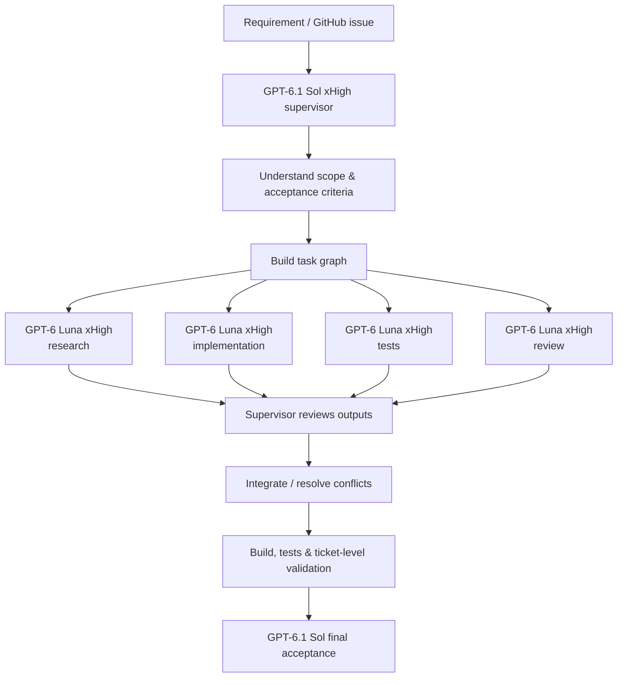

# AI-assisted development

MicroGreenPilot uses AI extensively as part of a structured software-engineering workflow.

This is not a "generate code and hope it works" process. AI is used inside a defined orchestration model with explicit ownership, bounded delegation, review, validation, and acceptance responsibilities.

> This document describes the intended workflow after MicroGreenPilot issue #168 is merged. Until that migration is complete, the private development repository remains the source of truth for the active harness configuration.

## Development AI vs product AI

There are two separate uses of AI around MicroGreenPilot:

```text
AI used to build MicroGreenPilot
├── repository research
├── implementation planning
├── coding and debugging
├── test development
├── documentation
├── review
└── validation assistance

AI used inside MicroGreenPilot
├── future crop-image analysis
├── tray/rack scanning
└── future grower assistance
```

This document is about the first category: **AI-assisted software development**.

Product-facing AI features are separate application capabilities and are designed so that deterministic business rules, persisted production state, permissions, schedules, and data ownership remain outside the AI layer.

## Orchestration model

The repository's standard agent workflow is:

| Responsibility | Model | Reasoning effort |
| --- | --- | --- |
| Ticket-wide supervision, architecture, integration, review, and final acceptance | GPT-6.1 Sol | xHigh |
| Discovery and repository research | GPT-6 Luna | xHigh |
| Bounded implementation and debugging | GPT-6 Luna | xHigh |
| Tests and validation | GPT-6 Luna | xHigh |
| Documentation and focused repository work | GPT-6 Luna | xHigh |
| Independent, adversarial, or security-focused review | GPT-6 Luna | xHigh |

The intentionally simple rule is:

> **GPT-6.1 Sol xHigh supervises. Every delegated GPT-6 Luna worker runs at xHigh.**

The worker model does not change effort level based on task type.

## Supervisor ownership

GPT-6.1 Sol acts as the ticket supervisor rather than merely another coding agent.

The supervisor owns:

- understanding the issue and acceptance criteria
- decomposing the work into bounded objectives
- establishing the task graph and sequencing
- making ticket-wide architectural decisions
- assigning work to bounded workers
- reviewing worker results and actual diffs
- resolving conflicts between proposed changes
- integrating the implementation
- coordinating ticket-level validation
- determining whether the complete ticket satisfies its acceptance criteria

A delegated worker does **not** own the ticket.

Workers cannot redefine the overall scope, silently change architectural direction, or approve their own work as complete.

## Bounded workers

GPT-6 Luna workers are used for focused objectives.

A worker assignment is expected to define:

```text
OBJECTIVE
What specific problem should be solved?

SCOPE
Which area of the repository may be changed or investigated?

CONSTRAINTS
What behavior, architecture, or security rules must remain intact?

EXPECTED RESULT
What code, evidence, analysis, or tests should be returned?

MODEL / EFFORT
GPT-6 Luna / xHigh
```

This keeps delegation narrow enough that the supervisor can meaningfully evaluate the result.

Typical worker objectives include:

- locating the implementation relevant to a bug
- researching an unfamiliar repository area
- implementing a bounded service or UI change
- debugging a failing test
- adding regression coverage
- checking documentation consistency
- reviewing a change from a security or adversarial perspective

## Typical execution flow



Delegation can be sequential or parallel depending on dependencies between objectives.

The important boundary is that worker output returns to the supervisor for review rather than automatically becoming accepted ticket state.

## Plan Mode

Planning and execution are deliberately separated.

Plan Mode remains non-mutating.

In Plan Mode:

- GPT-6.1 Sol xHigh owns planning
- GPT-6 Luna xHigh may be used for read-only repository research and discovery
- workers do not modify repository state
- the resulting implementation plan must respect the same architecture, security, and acceptance constraints as execution

This makes it possible to investigate a large change before granting an agent permission to modify the codebase.

## Verification before acceptance

AI-produced code is treated as a proposal until it has been validated.

Depending on the change, validation can include:

- diff inspection
- formatting and linting
- TypeScript compilation
- Angular builds
- NestJS builds
- frontend unit tests
- backend unit tests
- API integration tests
- database invariant tests
- Playwright end-to-end tests
- security-focused regression tests
- repository-specific configuration checks
- manual verification for flows that cannot be represented faithfully in automated CI

A worker reporting that a change is complete is not itself evidence that the ticket is complete.

The supervisor is expected to inspect the actual result and the relevant validation evidence.

## Independent review

The same worker model can also be used as an independent reviewer.

For example, a Luna xHigh worker can receive a completed change with instructions to look specifically for:

- incorrect assumptions
- authorization gaps
- cross-workspace data access
- concurrency problems
- missing error states
- incomplete tests
- regression risk
- unnecessary complexity

The original implementation is still accepted or rejected by the Sol supervisor after reviewing that feedback.

Using a separate review objective helps reduce the risk of an implementation agent simply confirming its own assumptions.

## Runtime verification and fallback policy

Repository configuration is not treated as proof that the requested model actually ran.

The workflow is expected to verify the effective model and reasoning effort where relevant.

The post-#168 policy does not silently downgrade when a configured model is unavailable.

For example:

```text
Requested:
GPT-6.1 Sol / xHigh

Runtime unavailable:
        ↓
STOP and report the mismatch

Not:
        ↓
silently use an older Sol model
```

The same principle applies to worker effort and security settings.

Model availability is never a reason to weaken sandboxing, approval requirements, validation, or repository security controls.

## My role in the workflow

AI does not decide what MicroGreenPilot should become.

I remain responsible for:

- product direction
- requirements
- deciding which problems are worth solving
- defining acceptance criteria
- choosing and evolving the architecture
- evaluating trade-offs
- deciding what reaches the codebase
- maintaining the repository's engineering standards

The agent harness is a way to increase engineering throughput while keeping work structured and reviewable.

A useful way to think about the relationship is:

```text
Product ownership & engineering direction
                │
                ▼
        Structured AI harness
                │
        ┌───────┴────────┐
        │                │
   Supervisor         Workers
        │                │
        └───────┬────────┘
                │
                ▼
       Tested implementation
                │
                ▼
       Human-owned project
```

## Why use a supervisor/worker model?

Large software tasks often contain several distinct activities:

```text
understand
research
design
implement
debug
test
review
integrate
```

Giving all of those activities to one unstructured generation step makes it difficult to distinguish assumptions from evidence.

The supervisor/worker model creates explicit boundaries.

It allows the project to use AI for parallel research and focused implementation while keeping one agent responsible for the ticket-wide context and integration.

This becomes particularly useful in MicroGreenPilot because changes frequently cross several layers at once:

```text
Angular
   ↕
NestJS
   ↕
authentication / authorization
   ↕
domain logic
   ↕
PostgreSQL
   ↕
tests
   ↕
CI
```

## Security and privacy

AI-assisted development follows the same repository-security expectations as other development work.

In particular:

- credentials and secrets do not belong in prompts or committed examples
- production secrets are not embedded in agent instructions
- private CI artifacts and logs are not intentionally published
- security-sensitive changes receive targeted review and regression testing
- the public portfolio repository does not mirror internal agent instructions or operational security runbooks

The exact private harness configuration, internal prompts, and repository-specific operating instructions are intentionally not published here.

This document describes the engineering model rather than providing a copy of the private agent harness.

## What AI does not replace

AI assistance does not replace:

- authorization
- database constraints
- deterministic domain rules
- source control
- testing
- CI gates
- security review
- architecture
- engineering judgment

A model producing plausible code is not considered proof of correctness.

## Why document this publicly?

AI-assisted development is part of how MicroGreenPilot is engineered, so hiding it would give an incomplete picture of the project.

The more useful question is not whether AI was used, but **how it was used**.

My goal is to use AI as an engineering multiplier inside a disciplined process:

> research faster, implement faster, test aggressively, review independently, and keep responsibility explicit.

That approach is more representative of the skills I want this project to demonstrate than either avoiding AI entirely or delegating the project to an unstructured autonomous coding process.
