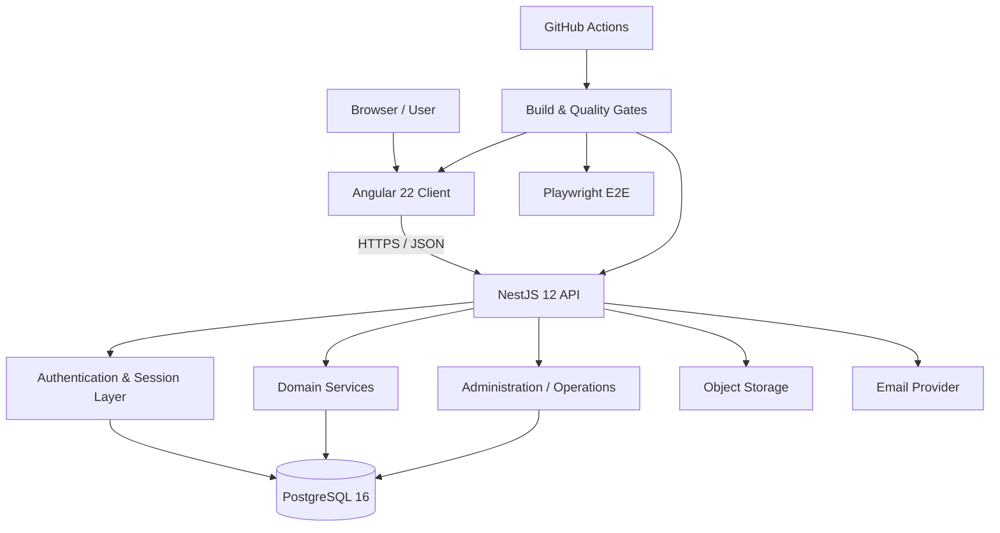
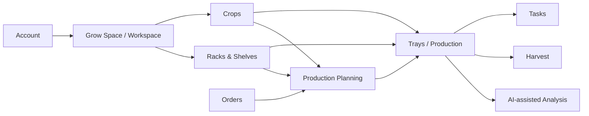

# Architecture

MicroGreenPilot is structured as a full-stack web application with a clear separation between client interaction, API/domain authority, authentication, and durable persistence.

This document is intentionally architectural. Operational configuration and security-sensitive implementation details remain private.

## System overview



## Frontend

The frontend is built with Angular and TypeScript.

Its responsibilities include:

- rendering authenticated and public product experiences
- forms and immediate validation feedback
- application routing and route-level UX
- responsive layouts
- persisted display preferences
- internationalization
- presentation of server-owned state

The client can perform UX-level validation and previews, but it is not trusted as the authority for permissions, ownership, entitlements, or business-critical state transitions.

## API

The backend is built with NestJS and TypeScript.

Controllers are kept close to the transport boundary. Domain services own business behavior, authorization checks, transactions, and persistence decisions.

Conceptually:

```text
HTTP request
    │
    ▼
Controller
    │
    ▼
Authentication / authorization boundary
    │
    ▼
Domain service
    │
    ├── validation
    ├── business rules
    ├── workspace/tenant scope
    └── transaction
            │
            ▼
        Drizzle ORM
            │
            ▼
        PostgreSQL
```

This keeps domain behavior testable without moving security or data-integrity responsibility into the browser.

## Data layer

PostgreSQL is the durable source of truth.

Drizzle ORM is used as the application persistence boundary, with explicit schema migrations rather than schema mutation during ordinary application startup.

The design favors database constraints for invariants that must remain valid regardless of which application path performs a write.

Examples of the broader approach include:

- explicit foreign-key relationships
- transactional multi-step mutations
- server-generated identifiers
- workspace-scoped records
- versioned configuration where historical behavior must remain reproducible
- direct database integration tests for important invariants

## Workspace / grow-space isolation

MicroGreenPilot is designed around server-authoritative workspace ownership.

A client-supplied identifier is never intended to be sufficient authorization on its own. The API must establish that the authenticated user can access the requested workspace and that referenced entities belong to the same authorized scope.

This principle applies across production entities such as trays, racks/shelves, tasks, crop configuration, planning, and future order/harvest workflows.

## Authentication

Authentication uses Better Auth integrated into the NestJS application.

Current product work includes:

- email/password authentication
- email verification
- Google authentication and account linking
- account recovery
- session management
- optional TOTP 2FA and backup codes
- role-based administrative access

The application adds its own domain and security boundaries around these primitives rather than treating the authentication library as the complete application security model.

See [Security overview](security-overview.md).

## Product domains

The application is evolving around several connected domains:



Not every domain shown above is production-complete today. The diagram represents the intended product architecture and how the areas relate.

## Configuration and preferences

The system separates personal display preferences from operational production settings.

Examples of personal preferences include:

- language
- theme
- date and time format
- measurement units
- personal timezone

Operational configuration, such as the timezone used to plan production, belongs to the workspace/grow-space domain.

This separation prevents a user's display preference from silently changing production semantics.

## Object storage

The backend has support for S3-compatible object-storage integration for assets such as user profile images.

Storage remains a backend concern: credentials and provider configuration are not intended to be exposed to the Angular client.

## Administration and operations

The private application contains role-aware administration and operational controls. The design separates normal user capabilities from higher-privilege administrative and site-operational actions.

Higher-risk mutations are designed to require stronger verification and produce auditable events.

This public repository intentionally does not publish the operational runbooks or privileged implementation details.

## Deployment direction

MicroGreenPilot is currently pre-release and does not claim a production deployment architecture here.

The intended deployment model keeps the same boundaries:

```text
Browser
   │
   ▼
Public HTTPS edge
   │
   ├── Angular application
   │
   └── NestJS API
           │
           ├── PostgreSQL
           ├── Object storage
           ├── Email provider
           └── Observability
```

Environment-specific credentials, deployment manifests, internal network assumptions, and operational procedures are deliberately excluded from the public portfolio repository.
