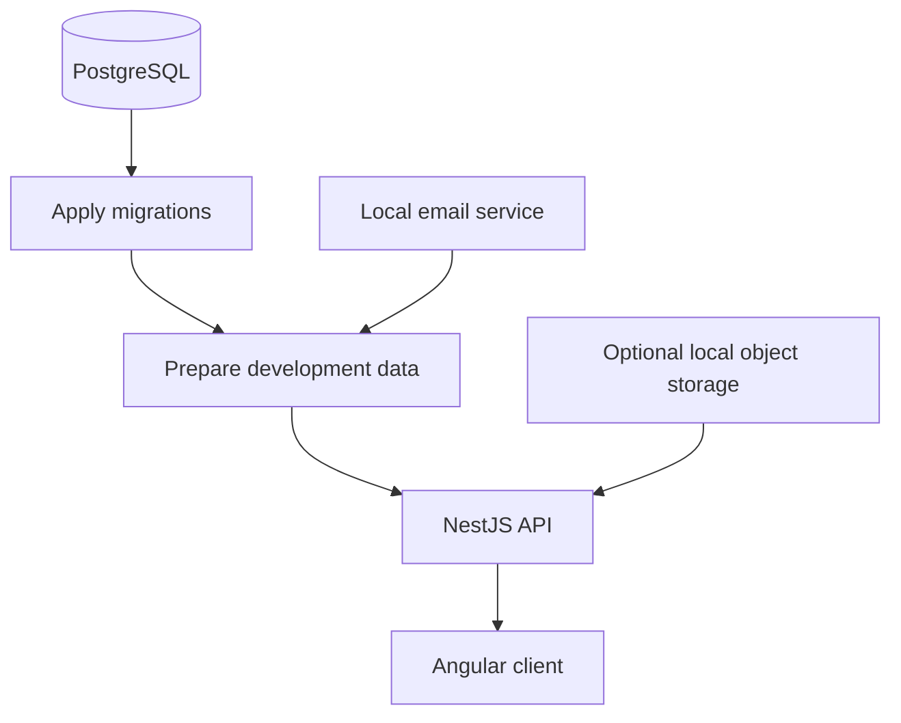
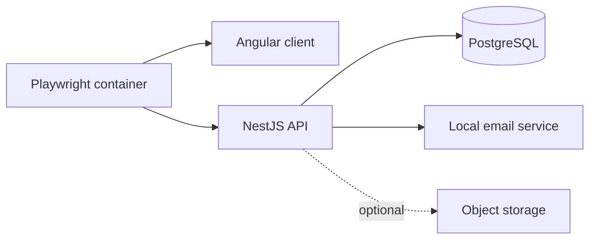
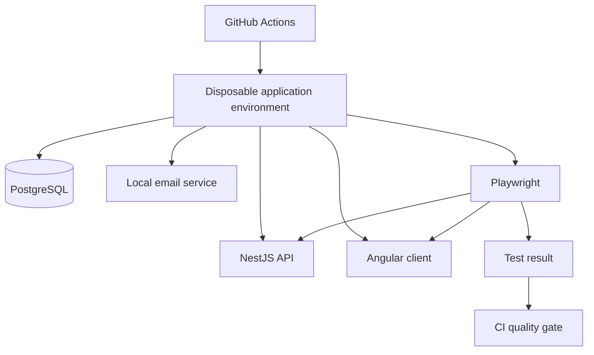

# Docker in local development and CI

Docker is a core part of MicroGreenPilot's development and test architecture.

This public document intentionally stays at an architectural level. It does **not** publish credentials, environment values, private hostnames, internal ports, secret-handling details, private workflow configuration, or operational security procedures.

Docker is used for two related goals:

1. make the local full-stack environment reproducible; and
2. run integration and browser-test workloads in CI against controlled, disposable environments.

Docker is **not** used for every CI job. Fast checks such as package installation, linting, builds, and many unit tests run directly on GitHub-hosted runners. Containers are used where service isolation, lifecycle behavior, real infrastructure dependencies, or browser-runtime consistency provide meaningful value.

## Local development

The local application is orchestrated with Docker Compose.

At a high level, the development environment contains:

| Service area | Purpose |
| --- | --- |
| PostgreSQL | Relational development database |
| Database lifecycle | Applies committed migrations and development seed data |
| NestJS API | Backend application and domain services |
| Local email service | Captures development email without external delivery |
| Angular client | Frontend development server |
| S3-compatible storage | Optional local object storage for image/avatar development |

The API and client run in lightweight Node-based development containers. Application source is mounted for active development, while container-owned dependency volumes keep container dependencies separate from host-installed packages.

### Startup lifecycle

The development stack is intentionally ordered instead of starting every service at once.



This gives the development environment a predictable lifecycle:

- the database becomes available before migrations run;
- migrations complete before development data is prepared;
- backend services become ready before dependent frontend workflows are considered available.

Schema changes remain explicit migration work rather than being silently created by normal application startup.

### Persistent and disposable state

The local environment separates durable development data from replaceable dependency state.

```text
Local Docker state
├── development database
├── container dependency volumes
└── optional local object-storage data
```

Normal restarts preserve development data. A deliberate reset can recreate the environment from a clean database and re-run the complete migration/seed lifecycle.

The reset path is explicit so ordinary startup does not unexpectedly destroy developer state.

### Development safety

The local launcher performs validation before starting the environment.

At a high level, those checks are intended to ensure that a development command operates on the expected local environment, that the rendered Compose configuration is valid, and that development-only services are not accidentally treated as deployment infrastructure.

The exact validation rules and operational safeguards remain in the private development repository.

## End-to-end test environment

Playwright browser tests run through a dedicated Docker image rather than depending on a browser installed directly on the developer machine.

The image combines a pinned Playwright runtime with the repository's selected Node runtime so browser execution is reproducible across local development and CI.



The browser-test environment keeps test dependencies and generated test state isolated from the normal developer checkout.

### Isolated E2E runs

Each E2E invocation creates its own disposable test environment.

Conceptually, the development stack and automated test stacks are separate:

```text
Developer stack
└── persistent local environment

E2E run A
└── isolated disposable environment

E2E run B
└── separate isolated disposable environment
```

This allows automated runs to coexist with the normal developer environment without intentionally sharing mutable application state.

The test launcher owns the lifecycle of the environment it creates and removes that environment when the run finishes.

## Docker in GitHub Actions

The private development repository uses GitHub Actions, with a deliberate mix of native runner jobs and containerized workloads.

### Native runner jobs

Fast package-oriented checks run directly on GitHub-hosted runners, including areas such as:

- dependency installation and auditing;
- API and client builds;
- linting and formatting;
- backend unit tests;
- frontend unit tests;
- repository configuration checks.

This avoids container startup overhead where isolation would add little value.

### PostgreSQL-backed integration jobs

Database-focused CI jobs use an isolated PostgreSQL service so integration tests can exercise a real relational database.

These jobs validate categories such as:

- migration history and repeatability;
- schema expectations;
- persistence behavior;
- authenticated API behavior;
- workspace/data isolation;
- concurrency-sensitive changes;
- database invariants.

The public documentation intentionally describes these checks by category rather than exposing private workflow configuration.

### Docker lifecycle validation

CI also validates the development container lifecycle itself.

The goal is to prove more than "the image builds." The checks cover representative lifecycle states such as:

```text
failed initialization
        ↓
clean first start
        ↓
normal restart
        ↓
explicit reset
        ↓
fresh start
```

This treats the developer environment as tested infrastructure.

### Dockerized Playwright E2E

The browser E2E lane uses the same containerized browser approach locally and in CI.

At a high level:



Using the same class of browser runtime in both environments reduces drift between local reproduction and CI.

### Object-storage integration

Image/avatar storage is also exercised against an isolated S3-compatible test service.

This allows storage behavior to be tested without coupling ordinary CI runs to a production cloud account.

The public repository intentionally does not document storage credentials, bucket configuration, endpoints, or provider-specific operational details.

## Reproducibility

Several design choices reduce environmental drift:

- runtime versions are controlled;
- PostgreSQL uses an explicit supported version;
- browser tests use a pinned Playwright environment;
- service readiness is checked rather than assuming fixed startup delays;
- automated test environments are disposable and isolated.

The goal is for failures found in CI to be reproducible locally using the same broad service topology.

## CI evidence and artifacts

Integration and browser tests can generate logs and reports.

The CI design treats retained evidence as something that must be intentionally selected rather than automatically publishing all raw service output.

Public documentation therefore discusses artifact handling only at a high level. Private logs, diagnostic payloads, authentication material, and internal retention rules are not mirrored into this repository.

## Why this architecture?

MicroGreenPilot crosses several infrastructure boundaries:

```text
Angular
   ↕
NestJS
   ↕
authentication
   ↕
PostgreSQL
   ↕
email
   ↕
object storage
   ↕
browser automation
```

A unit-test-only environment cannot prove that those systems start, communicate, persist data, and shut down correctly together.

The Docker strategy therefore aims for three properties:

**Reproducibility**  
Developers and CI use controlled runtime versions and service topology.

**Isolation**  
Automated runs use disposable environments that do not intentionally share mutable state with normal development.

**Realistic integration**  
Tests exercise real infrastructure boundaries where doing so provides meaningful confidence.

## What Docker is not used for

The current Docker setup is primarily a **development and test architecture**.

It should not be read as the final production deployment design. MicroGreenPilot is still pre-release, and production infrastructure will require separate decisions around deployment, networking, secrets, observability, backups, scaling, and operations.

Those production and security-operational details are intentionally outside the scope of this public portfolio repository.
