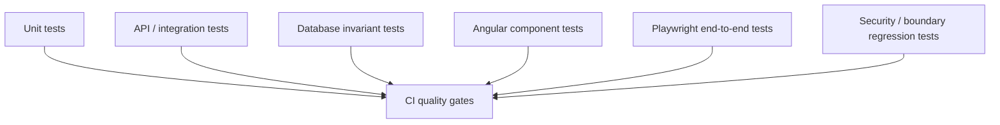
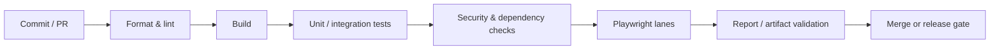

# Testing & CI

MicroGreenPilot uses multiple testing layers because different classes of failures appear at different boundaries.

The goal is not to maximize a single test-count number. The goal is to catch errors as close as practical to where they are introduced while still validating the complete user-critical flow.

## Test layers



### Backend unit tests

NestJS services and pure business logic are tested with Jest.

Good candidates include:

- validation rules
- state transitions
- authorization-support logic
- scheduling calculations
- security helpers
- error mapping

### Backend integration tests

Integration tests verify behavior that depends on real framework or persistence boundaries.

Examples include:

- authenticated API behavior
- database-backed state transitions
- workspace ownership
- migration/schema assumptions
- concurrency-sensitive mutations

### Database invariant tests

Some rules are important enough to verify directly against PostgreSQL.

These tests help prove that integrity does not depend solely on one application-service code path.

### Frontend tests

Angular tests cover component behavior, user interaction, forms, and important UI states.

Client tests are not used to claim backend authorization.

### End-to-end testing

Playwright exercises complete browser workflows against an isolated application stack.

Areas under E2E coverage include authentication, role/route behavior, onboarding, settings, and production-related flows.

The E2E suite has been an active engineering focus because parallel browser execution introduces challenges around shared state, user identities, cleanup, and repeatability.

## Isolation

A useful automated test should be able to fail without corrupting unrelated tests.

The project has been moving toward explicit ownership of test identities and mutable resources so parallel workers do not accidentally operate on the same data.

Important principles include:

- deterministic fixture ownership
- isolated accounts/resources
- explicit cleanup
- independent test lanes where appropriate
- no reliance on execution order
- failure-safe artifact handling

## Docker-based test environment

The repository uses Docker Compose to make local services and browser testing reproducible.

Conceptually:

```text
Docker test environment
├── PostgreSQL
├── API
├── Angular client
├── supporting test services
└── Playwright runner
```

This reduces host-machine differences and makes CI behavior closer to local reproduction.

For a deeper explanation of the local Compose stack, isolated browser-test projects, PostgreSQL service containers, object-storage testing, and how Docker is split across CI jobs, see [Docker in local development and CI](docker-and-ci.md).

## CI pipeline

The private development repository uses GitHub Actions.

The exact workflow definition and operational logs are intentionally not mirrored here, but the pipeline is designed around gates such as:



The pipeline is being optimized so the amount of CI work can depend on the importance of the change and lifecycle stage rather than treating every commit as an identical release candidate.

## Parallel Playwright work

One of the more substantial engineering areas has been making browser testing scale safely in parallel.

That requires more than increasing the worker count.

Parallelization work includes concerns such as:

- test-data ownership
- independent user identities
- resource cleanup
- mutable-state conflicts
- test sharding
- report reconciliation
- failure/cancellation behavior
- deterministic environment startup

This is particularly important for authentication-heavy end-to-end suites where naive parallelization can create intermittent failures.

## Security-related regression testing

Security-sensitive workflows receive explicit regression coverage.

Examples of the kinds of boundaries tested include:

- authorization
- authentication state
- account recovery
- two-factor flows
- account/provider changes
- workspace isolation
- privileged routes

Detailed threat models and operational security procedures remain private.

## Artifact hygiene

Logs and test reports are useful, but CI artifacts can also unintentionally expose information.

The development workflow therefore treats artifact creation and sanitization as part of the pipeline design rather than as an afterthought.

The public portfolio intentionally does not expose private Actions logs or internal CI artifacts.

## Cost and execution efficiency

CI cost is another engineering constraint.

Current optimization work includes evaluating:

- which checks belong on ordinary branch commits
- which checks are required for pull-request readiness
- which checks should run for merge/release candidates
- parallel versus sequential execution
- lighter runner options where appropriate
- dependency caching
- avoiding repeated environment setup

The objective is to preserve meaningful gates while reducing unnecessary compute.

## What this demonstrates

The testing approach is intended to show more than familiarity with test frameworks.

The larger engineering problem is building confidence across:

```text
frontend
   ↕
API
   ↕
authentication
   ↕
business logic
   ↕
database
   ↕
CI environment
```

Failures at those boundaries are often where production systems become difficult, so they receive disproportionate attention in MicroGreenPilot.
